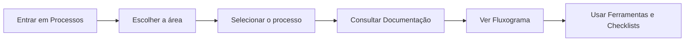

<!--
README.md — Central de Processos Contábeis Grow
Repositório: https://github.com/MateusMoller/processos-contabeis.git
-->

<div align="center">

# Central de Processos Contábeis Grow

### Procedimentos • Fluxogramas • Checklists • Calendários • Governança Operacional

<br>


<br>

> Repositório oficial para documentação, organização e evolução dos processos operacionais da Grow Contabilidade.

</div>

---

## Sumário

- [Sobre o repositório](#sobre-o-repositório)
- [Objetivo da central](#objetivo-da-central)
- [Mapa de navegação](#mapa-de-navegação)
- [Índice geral dos processos](#índice-geral-dos-processos)
  - [1. Comercial](#1-comercial)
  - [2. Contabilidade](#2-contabilidade)
  - [3. Departamento Pessoal](#3-departamento-pessoal)
  - [4. Fiscal](#4-fiscal)
- [Padrão oficial dos documentos](#padrão-oficial-dos-documentos)
- [Estrutura recomendada por processo](#estrutura-recomendada-por-processo)
- [Status dos processos](#status-dos-processos)
- [Boas práticas de manutenção](#boas-práticas-de-manutenção)
- [Convenção de nomenclatura](#convenção-de-nomenclatura)
- [Como consultar](#como-consultar)
- [Como incluir um novo processo](#como-incluir-um-novo-processo)
- [Governança recomendada](#governança-recomendada)
- [Checklist de qualidade](#checklist-de-qualidade)
- [Identificação do repositório](#identificação-do-repositório)

---

## Sobre o repositório

Este repositório funciona como a **central viva de processos da Grow Contabilidade**.

Aqui são armazenados e organizados:

<table>
  <tr>
    <td><strong>Procedimentos</strong></td>
    <td>Documentos formais com etapas, responsáveis, riscos, controles e indicadores.</td>
  </tr>
  <tr>
    <td><strong>Fluxogramas</strong></td>
    <td>Representações visuais dos processos para consulta rápida e treinamento.</td>
  </tr>
  <tr>
    <td><strong>Checklists</strong></td>
    <td>Listas de conferência para reduzir falhas, esquecimentos e retrabalho.</td>
  </tr>
  <tr>
    <td><strong>Calendários</strong></td>
    <td>Controles de prazos, obrigações e rotinas recorrentes.</td>
  </tr>
  <tr>
    <td><strong>Materiais de apoio</strong></td>
    <td>Modelos, formulários, planilhas, apresentações e documentos complementares.</td>
  </tr>
</table>

---

## Objetivo da central

A central foi criada para transformar o conhecimento operacional da Grow em uma base organizada, acessível e evolutiva.

| Pilar | Finalidade |
|---|---|
| **Padronização** | Garantir que as rotinas sejam executadas com método, clareza e consistência. |
| **Rastreabilidade** | Manter histórico, versões, responsáveis, documentos e fluxos em um único local. |
| **Treinamento** | Apoiar a integração de novos colaboradores e a capacitação da equipe. |
| **Continuidade** | Reduzir dependência de conhecimento informal ou concentrado em pessoas específicas. |
| **Governança** | Facilitar revisão, melhoria contínua e controle da operação. |

---

## Mapa de navegação

```text
processos-contabeis/
├── README.md
└── Processos/
    ├── 1 - Comercial/
    ├── 2 - Contabilidade/
    ├── 3 - Departamento Pessoal/
    ├── 4 - Fiscal/
    └── Manual da Grow.docx
```

### Acesso rápido

| Área | Caminho | Descrição |
|---|---|---|
| **Comercial** | [`Processos/1 - Comercial`](./Processos/1%20-%20Comercial) | Entrada de clientes, negociação, contratação e onboarding. |
| **Contabilidade** | [`Processos/2 - Contabilidade`](./Processos/2%20-%20Contabilidade) | Rotinas contábeis, conciliações, fechamentos e relatórios. |
| **Departamento Pessoal** | [`Processos/3 - Departamento Pessoal`](./Processos/3%20-%20Departamento%20Pessoal) | Admissão, folha, férias, demissão, adiantamentos e obrigações trabalhistas. |
| **Fiscal** | [`Processos/4 - Fiscal`](./Processos/4%20-%20Fiscal) | Apurações, guias, regimes tributários, notas fiscais e obrigações acessórias. |
| **Manual da Grow** | [`Manual da Grow.docx`](./Processos/Manual%20da%20Grow.docx) | Documento institucional e operacional geral. |

---

# Índice geral dos processos

## 1. Comercial

> Área responsável pelos processos de entrada de clientes, negociação, contratação, cadastro, onboarding e passagem para a operação.

| Processo | Finalidade | Status |
|---|---|---|
| Fluxo de Entrada de Cliente | Padronizar a entrada de novos clientes, desde o lead até o encerramento do onboarding. |  |
| Procedimento de Abertura de Cliente | Documentar as etapas de formalização, cadastro, contrato e integração interna do cliente. |  |

<details>
<summary><strong>Ver objetivo da área Comercial</strong></summary>

A área Comercial deve garantir que todo novo cliente entre na operação com escopo definido, contrato formalizado, dados mínimos coletados, cadastro estruturado e equipe interna alinhada.

Principais controles esperados:

- identificação correta da demanda do cliente;
- definição do plano contratado;
- formalização contratual;
- coleta de dados cadastrais;
- classificação do cliente;
- reunião interna de alinhamento;
- encerramento formal do onboarding.

</details>

---

## 2. Contabilidade

> Área responsável por rotinas contábeis, conciliações, fechamentos, demonstrações, análises e entregas técnicas do setor contábil.

| Processo | Finalidade | Status |
|---|---|---|
| Processos Contábeis | Espaço destinado à documentação das rotinas do setor contábil. |  |

<details>
<summary><strong>Ver objetivo da área Contábil</strong></summary>

A área Contábil deve reunir processos que garantam organização, consistência e rastreabilidade nas rotinas de escrituração, conciliação, fechamento e geração de relatórios.

Exemplos de processos que podem compor esta área:

- conciliação bancária;
- fechamento contábil mensal;
- análise de balancete;
- conferência de contas patrimoniais;
- elaboração de demonstrativos;
- entrega de relatórios gerenciais;
- controle de pendências contábeis.

</details>

---

## 3. Departamento Pessoal

> Área responsável por admissões, folha de pagamento, férias, desligamentos, adiantamentos, obrigações trabalhistas e rotinas mensais relacionadas aos colaboradores dos clientes.

| Processo | Finalidade | Status |
|---|---|---|
| Fluxo de Admissão | Padronizar solicitação, conferência documental, cadastro, envio e conclusão da admissão. |  |
| Fluxo de Folha de Pagamento | Organizar etapas de fechamento, cálculo, conferência e envio da folha. |  |
| Fluxo de Adiantamento de Salário | Documentar solicitação, validação e processamento de adiantamentos. |  |
| Fluxo de Demissão | Padronizar desligamento, cálculo, conferência e envio das informações. |  |
| Calendário Departamento Pessoal | Centralizar prazos e rotinas recorrentes do DP. |  |
| Introdução ao Departamento Pessoal | Material de apoio para entendimento da área e suas principais responsabilidades. |  |

<details>
<summary><strong>Ver objetivo da área de Departamento Pessoal</strong></summary>

A área de Departamento Pessoal deve garantir que as rotinas trabalhistas sejam executadas com segurança, cumprimento de prazos, documentação adequada e conferência antes da entrega ao cliente.

Principais frentes:

- admissões;
- folha de pagamento;
- férias;
- rescisões;
- adiantamentos;
- obrigações acessórias;
- controle de prazos;
- conferência documental;
- comunicação com clientes.

</details>

---

## 4. Fiscal

> Área responsável por rotinas fiscais, regimes tributários, apuração de impostos, guias, notas fiscais, declarações, obrigações acessórias, parcelamentos e conferências.

| Processo | Finalidade | Status |
|---|---|---|
| Simples Nacional | Reunir processos e materiais relacionados às empresas optantes pelo Simples Nacional. |  |
| Lucro Real | Reunir processos e orientações relacionadas às empresas do Lucro Real. |  |
| Lucro Presumido | Reunir processos e orientações relacionadas às empresas do Lucro Presumido. |  |
| MEI — Emissão de Guia DAS | Padronizar a emissão de guias DAS para Microempreendedor Individual. |  |
| Apuração de Impostos | Documentar a rotina de apuração mensal dos tributos. |  |
| Declaração de Impostos | Organizar rotinas de declarações e obrigações acessórias fiscais. |  |
| Parcelamento de Impostos | Padronizar levantamento, solicitação e acompanhamento de parcelamentos. |  |
| Emissão de NFs | Documentar procedimentos de emissão, conferência e orientação sobre notas fiscais. |  |
| Fluxo de Cumprimento de Obrigações | Controlar prazos, obrigações e entregas fiscais recorrentes. |  |
| Fluxo de Conferência Final | Padronizar revisão final antes do fechamento ou entrega de obrigações. |  |
| Fluxo de Entrada de Documentos | Organizar recebimento, validação e direcionamento de documentos fiscais. |  |
| Calendário Fiscal | Centralizar prazos fiscais e obrigações recorrentes. |  |
| Introdução ao Fiscal | Material de apoio para entendimento da área fiscal. |  |

<details>
<summary><strong>Ver objetivo da área Fiscal</strong></summary>

A área Fiscal deve garantir que a apuração, conferência, emissão de guias, entrega de obrigações e orientação fiscal sejam executadas com controle, segurança técnica e cumprimento de prazos.

Principais frentes:

- apuração de impostos;
- emissão de guias;
- conferência de notas fiscais;
- cumprimento de obrigações acessórias;
- análise de regimes tributários;
- controle de parcelamentos;
- revisão final antes das entregas;
- acompanhamento de calendário fiscal.

</details>

---

# Padrão oficial dos documentos

Todo procedimento documentado deve seguir, preferencialmente, a estrutura abaixo:

```text
1. Objetivo
2. Aplicação
3. Responsáveis
4. Sistemas utilizados
5. Entradas
6. Saídas
7. Prazo
8. Riscos
9. Controles
10. Indicadores
11. Fluxo resumido
12. Histórico de revisão
```

<details>
<summary><strong>Detalhamento de cada seção</strong></summary>

| Seção | O que deve conter |
|---|---|
| **Objetivo** | Explicação clara do propósito do processo. |
| **Aplicação** | Situações, áreas ou clientes aos quais o processo se aplica. |
| **Responsáveis** | Pessoas, setores ou papéis envolvidos na execução e validação. |
| **Sistemas utilizados** | Sistemas, portais, planilhas ou ferramentas necessárias. |
| **Entradas** | Informações, documentos ou solicitações que iniciam o processo. |
| **Saídas** | Resultado esperado após a conclusão do processo. |
| **Prazo** | Prazos legais, internos ou operacionais. |
| **Riscos** | Consequências caso o processo não seja executado corretamente. |
| **Controles** | Pontos de verificação obrigatórios para reduzir falhas. |
| **Indicadores** | Métricas sugeridas para acompanhar desempenho e qualidade. |
| **Fluxo resumido** | Sequência simplificada das principais etapas. |
| **Histórico de revisão** | Registro de versões, datas, alterações e responsáveis. |

</details>

---

# Estrutura recomendada por processo

Cada processo deve seguir a seguinte organização interna:

```text
Nome do Processo/
├── 1 - Documentação/
│   ├── Procedimento - Nome do Processo.docx
│   └── Procedimento - Nome do Processo.pdf
├── 2 - Fluxograma/
│   ├── Fluxograma - Nome do Processo.drawio
│   └── Fluxograma - Nome do Processo.png
└── 3 - Ferramentas-Documentos/
    ├── Checklist - Nome do Processo.xlsx
    ├── Modelo - Documento de Apoio.docx
    └── Materiais complementares
```

| Pasta | Finalidade |
|---|---|
| **1 - Documentação** | Procedimento formal em versão editável e final. |
| **2 - Fluxograma** | Representação visual do processo em arquivo editável e imagem. |
| **3 - Ferramentas-Documentos** | Checklists, modelos, planilhas, formulários e materiais auxiliares. |

---

# Status dos processos

| Status | Badge | Significado |
|---|---|---|
| Em estruturação |  | Processo ainda está sendo criado, levantado ou organizado. |
| Em revisão |  | Processo já possui conteúdo e aguarda validação interna. |
| Validado |  | Processo revisado e aprovado para uso oficial. |
| Em atualização |  | Processo validado que está passando por melhoria ou ajuste. |
| Obsoleto |  | Processo substituído ou descontinuado, mantido apenas para histórico. |

---

# Boas práticas de manutenção

- Manter a nomenclatura das pastas padronizada.
- Evitar arquivos duplicados ou versões soltas fora da estrutura oficial.
- Registrar alterações relevantes no histórico de revisão do documento.
- Manter, sempre que possível, uma versão editável e uma versão final em PDF.
- Revisar periodicamente os processos por área.
- Identificar documentos antigos, substituídos ou obsoletos.
- Guardar checklists e ferramentas de apoio junto ao processo correspondente.
- Atualizar este README sempre que um processo for criado, removido, renomeado ou validado.

---

# Convenção de nomenclatura

Utilize nomes objetivos, claros e padronizados.

```text
Procedimento - Nome do Processo.docx
Procedimento - Nome do Processo.pdf
Fluxograma - Nome do Processo.drawio
Fluxograma - Nome do Processo.png
Checklist - Nome do Processo.xlsx
Modelo - Nome do Documento.docx
Calendário - Nome da Área.xlsx
```

Exemplo:

```text
Procedimento - Admissão de Colaborador.docx
Fluxograma - Admissão de Colaborador.png
Checklist - Documentos Admissionais.xlsx
```

---

# Como consultar

Para localizar um processo:



> O GitHub pode não renderizar Mermaid em todos os ambientes de pré-visualização, mas renderiza normalmente na visualização do README dentro do repositório.

Passo a passo:

1. Acesse a pasta `Processos/`.
2. Escolha a área correspondente.
3. Entre na pasta do processo desejado.
4. Consulte primeiro a pasta `1 - Documentação`.
5. Use a pasta `2 - Fluxograma` para visualizar o fluxo de forma rápida.
6. Verifique a pasta `3 - Ferramentas-Documentos` para modelos, checklists e materiais auxiliares.

---

# Como incluir um novo processo

Ao criar um novo processo, siga este roteiro:

- [ ] Criar a pasta do processo dentro da área correspondente.
- [ ] Separar os arquivos em `1 - Documentação`, `2 - Fluxograma` e `3 - Ferramentas-Documentos`.
- [ ] Elaborar o procedimento no padrão oficial.
- [ ] Criar ou atualizar o fluxograma do processo.
- [ ] Incluir checklists, modelos ou planilhas relacionados.
- [ ] Atualizar o índice deste README.
- [ ] Registrar a versão inicial no histórico de revisão.
- [ ] Submeter o processo para revisão interna, quando aplicável.

---

# Governança recomendada

| Área | Responsável pela manutenção | Frequência sugerida de revisão |
|---|---|---|
| Comercial | A definir | Trimestral |
| Contabilidade | A definir | Trimestral |
| Departamento Pessoal | A definir | Trimestral |
| Fiscal | A definir | Trimestral |
| Manual da Grow | A definir | Semestral |

<details>
<summary><strong>Critérios sugeridos para validação de um processo</strong></summary>

Um processo pode ser considerado validado quando:

- possui objetivo claro;
- possui responsáveis definidos;
- possui etapas descritas de forma compreensível;
- possui pontos de controle;
- possui riscos mapeados;
- possui fluxo resumido;
- possui histórico de revisão;
- foi revisado pela área responsável;
- está armazenado na estrutura correta do repositório.

</details>

---

# Checklist de qualidade

Antes de considerar um processo pronto para uso, valide:

| Critério | Situação |
|---|---|
| O processo possui objetivo claro? | `A validar` |
| A aplicação está bem delimitada? | `A validar` |
| Os responsáveis estão definidos? | `A validar` |
| As etapas estão em ordem lógica? | `A validar` |
| Existem pontos de controle? | `A validar` |
| Os principais riscos foram descritos? | `A validar` |
| Existem indicadores sugeridos? | `A validar` |
| O fluxograma está salvo em versão editável? | `A validar` |
| O PDF final foi gerado? | `A validar` |
| O README foi atualizado? | `A validar` |

---

# Histórico de revisão dos documentos

Cada procedimento deve conter ao final uma tabela de revisão:

| Versão | Data | Alteração | Responsável |
|---|---|---|---|
| 1.0 | dd/mm/aaaa | Estruturação inicial do processo. | Responsável |
| 1.1 | dd/mm/aaaa | Ajustes de etapas, controles ou responsabilidades. | Responsável |

---

# Identificação do repositório

| Campo | Informação |
|---|---|
| Nome do repositório | `processos-contabeis` |
| URL | `https://github.com/MateusMoller/processos-contabeis.git` |
| Organização/usuário | `MateusMoller` |
| Finalidade | Central de processos operacionais contábeis da Grow |
| Público-alvo | Equipe interna da Grow |
| Tipo de conteúdo | Procedimentos, fluxogramas, checklists, calendários e documentos de apoio |

---

<div align="center">

## Propósito final

**Processos bem documentados fortalecem a operação, reduzem retrabalho, preservam conhecimento e tornam o crescimento mais seguro.**

<br>

<strong>Grow Contabilidade</strong>  
Mais do que contabilidade, parceria para crescer.

</div>
